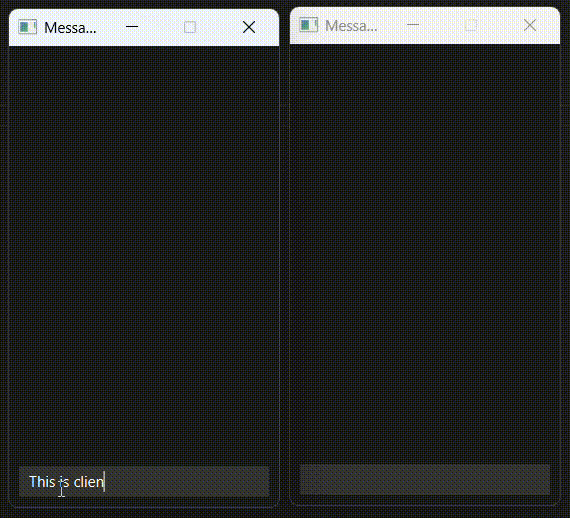

# Messager

**Secure Instant Point-to-Point Messaging App**  
Author: Blaine Jones  
Course: CS-4173 Computer Security  
Instructor: Dr. Shangqing Zhao

## Overview

**Messager** is a secure, Java-based, peer-to-peer (P2P) messaging application designed for encrypted text communication between two users. It uses JavaFX for the user interface and incorporates strong encryption and authentication mechanisms for secure communication.

## Features

- Peer-to-peer (P2P) communication using sockets
- AES encryption in CBC mode with PKCS7 padding
- Daily key derivation using PBKDF2 with SHA-1 and salt based on the current date
- Encrypt-then-authenticate message scheme with integrity checking
- Dynamic client/host behavior: first user becomes host; second becomes client
- Automatically alternating IVs for message chaining
- Multithreaded message reception
- Simple JavaFX UI with plaintext and ciphertext display

## How It Works

### Application Flow

1. **Login Screen**:
   - Users input the target IP address and a shared secret password.
   - The first user attempts to connect as a client. If unsuccessful, becomes the host.

2. **Connection Setup**:
   - The host waits for a client.
   - Once both users are connected, the messaging window opens.

3. **Messaging**:
   - Users type messages into a text box; pressing Enter sends the message.
   - Both plaintext and ciphertext (UTF-8 encoded) are displayed.

### Encryption and Security

- **Key Derivation**:
  - A 256-bit AES key is derived using PBKDF2 with SHA-1, salted by the current date.

- **Initialization Vector (IV)**:
  - IV for the first message is based on a hash of the password.
  - IV for each subsequent message is taken from the last ciphertext block of the previous message.

- **Message Class**:
  - Stores both plaintext and ciphertext.
  - Performs encryption/decryption and message authentication.
  - Uses encrypt-then-authenticate: hashes the ciphertext and appends the hash to the message.

- **Transmission**:
  - Only ciphertext is transmitted using ObjectOutputStream.
  - Messages are wrapped in a `ByteWrapper` to prevent transmission corruption.

## Class Structure

- `Login`: Launches login GUI and handles user input.
- `Messager`: Controls main app logic and GUI, manages message flow and encryption.
- `Message`: Encapsulates encryption/decryption logic and message authentication.
- `Hoster`: Server-side socket logic.
- `Clienter`: Client-side socket logic.
- `ByteWrapper`: Ensures byte array integrity over transmission.

## Limitations & Future Improvements

- **GUI Delay for Host**:
  - The host’s GUI does not appear until a client connects.
  - Could be improved with a connection status screen or timeout feedback.

- **IV Syncing Issue**:
  - If messages are sent nearly simultaneously, message order may desynchronize, resulting in failed decryption.

- **Host/Client Class Redundancy**:
  - Hoster and Clienter share similar logic and could be merged using a shared superclass or strategy pattern.

## Screenshots

*(Insert screenshots of the login screen and messaging interface if available.)*

## Build and Run

### Prerequisites

- Java JDK 11+
- JavaFX SDK
- IDE (e.g., IntelliJ, Eclipse) or CLI support for JavaFX

## AI Disclaimer

All code in this repo and the Project Report PDF were written by me **without the use of AI**. 

**HOWEVER**, this README was generated using ChatGPT based on the Project Report PDF. 

